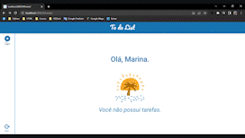
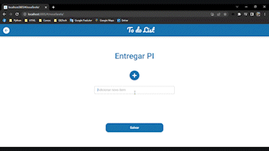
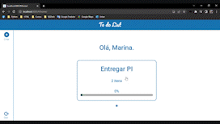

# Projeto Integrador: Análise de Soluções Integradas para organizações

Projeto desenvolvido para disciplina de Projeto Integrador do curso de Análise e Desenvolvimento de Sistemas do SENAC - 5º Semestre - EAD.
O To-Do List é uma aplicação web, responsiva para dispositivos pequenos, que visa auxiliar o usuário a organizar as tarefas do dia a dia.
O sistema permite a inclusão, alteração e exclusão de tarefas, possibilitanto uma melhor coordenação das atividades diárias.

## ✔️ Tópicos
📍 [Construído com](#construído-com)

📍 [Pré-requisitos](#pré-requisitos)

📍 [Funcionalidades](#funcionalidades)

📍 [Como rodar a aplicação](#como-rodar-a-aplicação)

📍 [Autores](#autores)

## 🛠️ Construído com
🔹 Flutter/Dart [](https://skillicons.dev)

🔹 Node.js
[](https://skillicons.dev)

🔹 TypeScript
[](https://skillicons.dev)

🔹 PostgreSql
[](https://skillicons.dev)

🔹 Docker
[](https://skillicons.dev)

## 📋 Pré-requisitos
É necessário ter o docker instalado na máquina, conforme site oficial: https://docs.docker.com/desktop/

## 🔨 Funcionalidades
A aplicação permite a inclusão, alteração e exclusão de itens.








## ▶️ Como rodar a aplicação
Após baixar o projeto você deverá abrir o terminal na pasta raíz do projeto e rodar o comando:

```
docker compose up --build
```

Após a inicialização de todos os serviços/containers (app_flutter, bff_node e db_postgres) você deverá acessar a url:

```
http://localhost:3005/#/home/
```

## 💻 Autores
#### Grupo 19
- Alexandre Silva Lucindo
- Andrea Pereira dos Santos
- Clayse Alves Silva do Nascimento
- Edvaldo Delarissia
- Felipe Bello Labiapari
- Sharllana Paolla Oliveira Maximo
- Sergio Rodrigo Coelho Rios